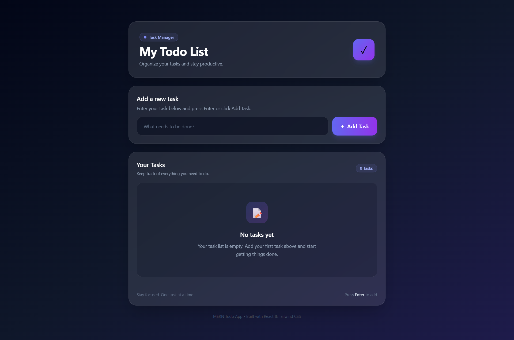
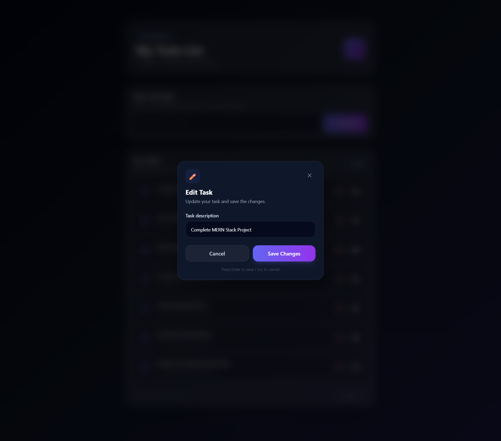
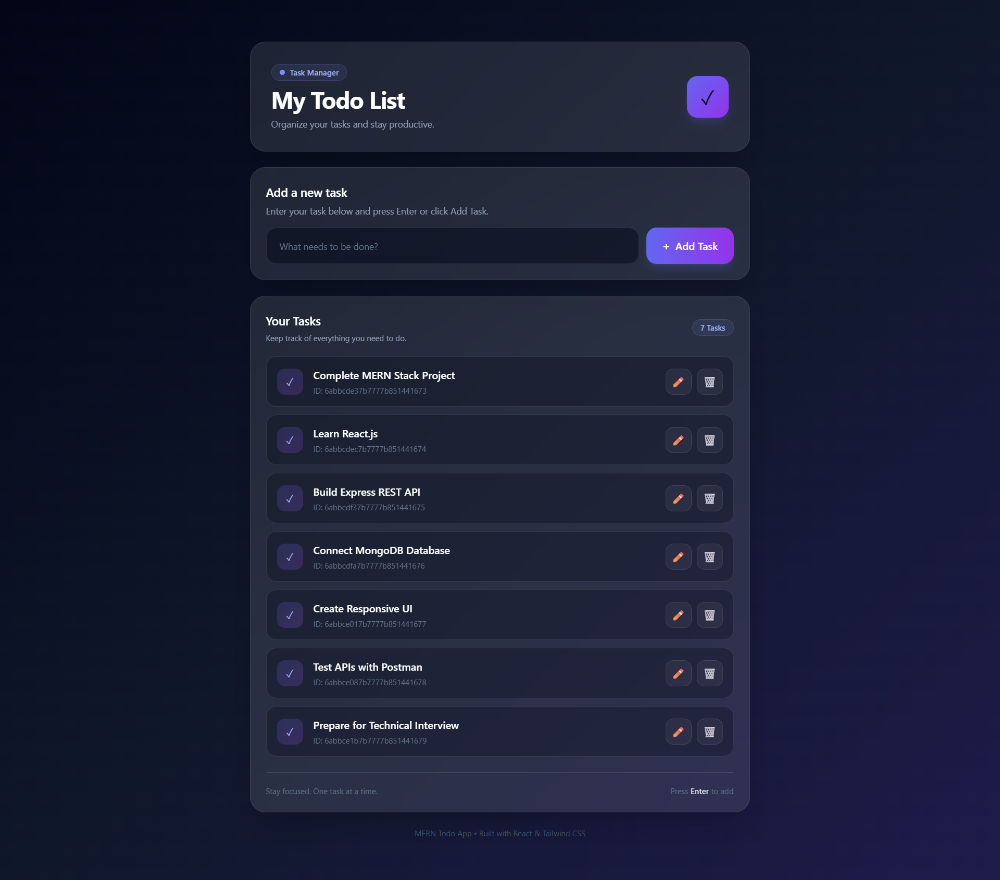

# 📝 MERN Todo List Application

A full-stack Todo List Application built using **React.js, Node.js, Express.js, MongoDB, and Mongoose**.

The application allows users to create, view, update, and delete todos through a REST API with a modern, responsive, and user-friendly interface.

---

## 🔗 Live Demo

👉 [View Live Project](YOUR_LIVE_PROJECT_URL)

---

## 📸 Screenshots

<table>
  <tr>
    <td align="center">
      <b>🏠 Todo Dashboard</b><br><br>
      
    </td>
    <td align="center">
      <b>✏️ Edit Todo</b><br><br>
      
    </td>
    <td align="center">
      <b>📋 Todo List</b><br><br>
      
    </td>
  </tr>
</table>

---

## 🚀 Features

- ✅ Add new todos
- 📋 Display all todos
- ✏️ Update existing todos
- 🗑️ Delete todos
- 🪟 Modern edit modal
- ⌨️ Add todos using the Enter key
- 🔄 Loading state
- 📭 Empty todo state
- 🔢 Dynamic task counter
- 🎨 Modern glassmorphism UI
- 🌈 Gradient background
- ✨ Smooth hover animations
- 📱 Responsive design
- 🔗 REST API using Express.js
- 🗄️ MongoDB database integration
- 📦 Mongoose for database management
- ⚡ Axios for API requests
- 🌐 CORS enabled
- 🔐 Environment variables using `.env`

---

## 🛠️ Technologies Used

### Frontend

- React.js
- Vite
- Tailwind CSS
- JavaScript
- Axios
- HTML5
- CSS3

### Backend

- Node.js
- Express.js
- MongoDB
- Mongoose
- CORS
- dotenv
- Nodemon

### Tools

- Visual Studio Code
- Git
- GitHub
- Postman

---

## 🏗️ Application Architecture

```text
React.js Frontend
       │
       │ Axios HTTP Requests
       ▼
Express.js REST API
       │
       ▼
Controllers
       │
       ▼
Mongoose Model
       │
       ▼
MongoDB Database
